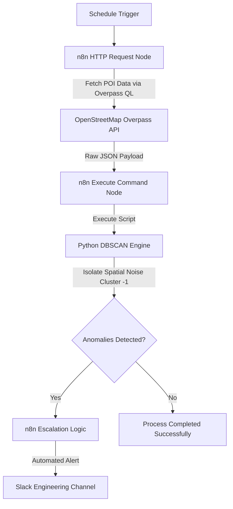

# Automated POI Data Quality Assurance & Alert Workflow

An automated data pipeline designed to monitor, analyze, and ensure the integrity of high-scale Point of Interest (POI) datasets. By integrating **n8n orchestration** with the **OpenStreetMap Overpass API** and a custom **DBSCAN clustering model**, this platform eliminates manual data ingestion and automates detection and escalation of spatial anomalies.

## Business Case

In location-based industries (AdTech, mobile marketing, and footfall analytics), data drift and poor spatial data quality directly lead to flawed targeting, budget waste, and broken attribution models. 

To avoid said flaws in models caused by poor data, this platform ensures:
* **Operational Continuity:** Automating the technical handoff from data ingestion into ongoing data-quality monitoring.
* **Platform Scalability & Performance:** Segmenting and throttling API payloads to mitigate processing latency and optimize compute resources.
* **Risk Management:** Catching spatial anomalies (faulty coordinates, user input errors) before they hit production, automatically escalating high-severity data issues to engineering teams.

This workflow was designed to regularly fetch POI data from OpenStreetMap that is labeled as a restaurant in New York City, automatically execute a DBSCAN analysis, and alert the adequate channel in Slack if there are any anomalies in the output.

Additionally, this analysis can be used to gain **business insights**, as it can detect a newly opened restaurant, as well as whether that restaurant appeared in an area with low competition.

---

## System Architecture

The pipeline operates as a fully automated data workflow, shifting data quality checks from a reactive manual process to a proactive, real-time operation.



## DBSCAN Analysis 

DBSCAN was selected over centroid-based clustering algorithms like K-Means because it automatically discovers clusters of varying shapes and densities while natively detecting anomalous data points without requiring a predefined cluster count

Parameters:
1. Epsilon ($\epsilon$): Converted via the Haversine Formula to handle true geographical distance on the Earth's curved surface. Tuned to 100 meters to map dense commercial grids and identify hyper-local food hubs.

2. MinSamples: Set to 5 points to establish a statistically valid spatial cluster.


## Repository Structure

* **dbscan_analysis.py** - Production-ready Python script utilizing pandas, numpy, and scikit-learn to process coordinate geometry.

* **workflow.json** - Complete n8n workflow configuration file. Can be imported directly into any enterprise n8n environment via GUI.

* **requirements.txt** - Python environment dependencies.

* **newyork_restaurants_raw.json/** - Sample raw JSON file pulled from the Overpass API for testing reproducibility.


## Quick Start & Installation

1. **Local Python Setup**


```bash
# Clone the repository
git clone <your-repo-url>
cd <your-repo-name>

# (Optional) Create and activate a virtual environment
python3 -m venv venv
source venv/bin/activate  # On Windows use: venv\Scripts\activate

# Install required dependencies
# - Mac/Linux:
pip3 install -r requirements.txt

# - Windows:
pip install -r requirements.txt
```


2. **Import to n8n:**
 - Open your n8n instance.
 - Click **Import** from **File** in the top-right menu and upload the **workflow.json**.
 - Configure your local file paths in the Execute Command node to execute **dbscan_analysis.py**:

 ```bash
python3 /absolute/path/to/your/project/dbscan_analysis.py
```
- Configure your Slack node credentials to connect it to your workspace channel.
